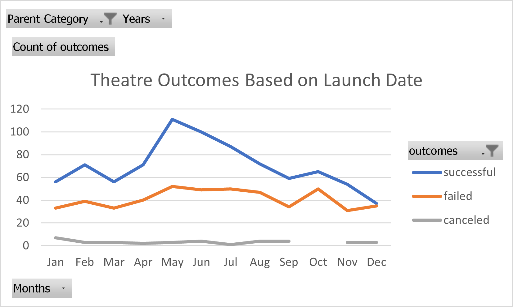
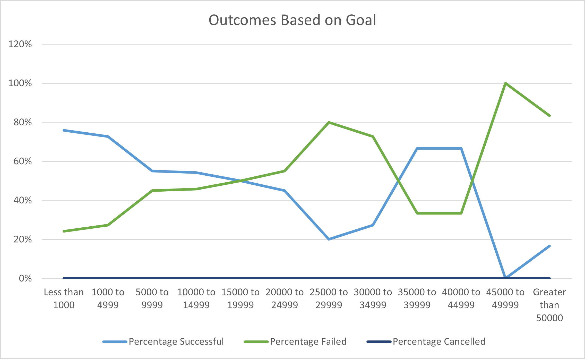

# Kickstarting with Excel

## Overview of Project

### Purpose

- The purpose of this project is to visualize the campaign outcomes based on launch date and their funding goals, in order to analyze the relationships between outcomes and date, and between outcomes and goals. 

## Analysis and Challenges

### Analysis of Outcomes Based on Launch Date

- According to the graph, at the beginning of the year from January to April, the successful outcomes fluctuates between 60 and 80. There is a peak of successful launches in May, and successful launches decrease from June to September, followed with a slight increase from September to October, and then another decrease until the end of the year. The line which shows the failed outcomes follows an identical trend, with fewer outcomes overall. This shows that as the number of successful outcomes increases, the number of failed outcomes also increases. The biggest gap between successes and fails is in May, with 59 more successes than fails. The smallest gap between those numbers is in December, with only 2 more successes than fails. During October, when both the successful outcomes and the failed outcomes slightly increase, there is no cancelled launches. According to both the table and the graph, the number of canceled launches stays below 10 every month. 

[Kickstarter_Challenge.xlxs](Kickstarter_Challenge.xlxs)

### Analysis of Outcomes Based on Goals

- The graph shows a decrease of percentages of success from less than $1000 to $29999. The percentage of success drops from 76% to 20%. The graph shows an increase from $30000 (20%) to $44999 (67%), and then another drastic decrease to 0% when the goal is $45000 to $49999, and eventually a slight increase at the end when the goal is greater than $50000. According to the table, there were no plays canceled in any goal ranges. Generally speaking, launches with goals of fewer dollar amounts tend to have higher percentages of success, with the exception of $35000 to $49999. It is possible that this exception is due to the fact that there were fewer projects launches in those ranges of goals, so the success or failure of each individual launch affect the percentage greatly. This would explain the lack of an obvious trend in the graph. 

[Kickstarter_Challenge.xlxs](Kickstarter_Challenge.xlxs)

### Challenges and Difficulties Encountered

- One of the challenges I encountered was converting Unix date to human readable date. Different websites provided different formulae, and they were confusing to me since I did not know what Unix epoch was and why it was based on January 1st, 1970. I read about Unix epoch on Wikipedia and understood the formula better.

- Another challenge I encountered was trying to extract the month from the date. I knew I needed to put it into three-letter format (Jan, Feb, etc.) since the solution graph shows the months in this format. I watched a YouTube video where the guy explains how he extracts months from dates, except his shows up as the whole word (January instead of Jan), and he uses ”mmmm.” I figured if I use “mmm” it would show up as the three initial letters instead of the whole word, and it worked.

## Results

- What are two conclusions you can draw about the Outcomes based on Launch Date?

    - In May, the number of successful launches reaches its highest peak.
    - In December, there are almost the same amount of successful launches and failed launches.

- What can you conclude about the Outcomes based on Goals?

    - There are fewer total projects with larger goals than with smaller goals, and generally speaking launches with goals of fewer dollar amounts tend to have higher percentages of success.

- What are some limitations of this dataset?

    - There were way fewer projects that were launched with the goals of larger dollar amounts. For example, there was only one project with the goal of $45000 to $49999, and it failed, so the success percentage looks like 0%. If just one more project were to launch with the same goal and succeed, the success percentage raises to 50%. With fewer data to work with, each data affects the percentage to a large extent.

    - Another limitation is that the same month could mean vastly different things in different countries. For example, in the US July is in the summer, whereas in Australia July is in the winter, and that might affect the outcomes. Also, there are holidays in one country that are not celebrated in other countries, and that could also affect the outcomes, since it is common for people to enjoy theatres and plays during holidays.  

- What are some other possible tables and/or graphs that we could create?

    - We could look at the relationships between the country of launch and the outcomes of the launches since different cultures in different countries might affect how popular a theatre or a play is in a particular country. 

    - Another relationship we could look at is the relationship between the outcomes and whether the theatre or play is a staff pick. This will help us determine if staff picks are helpful at predicting which theatre or play is going to be popular. 
